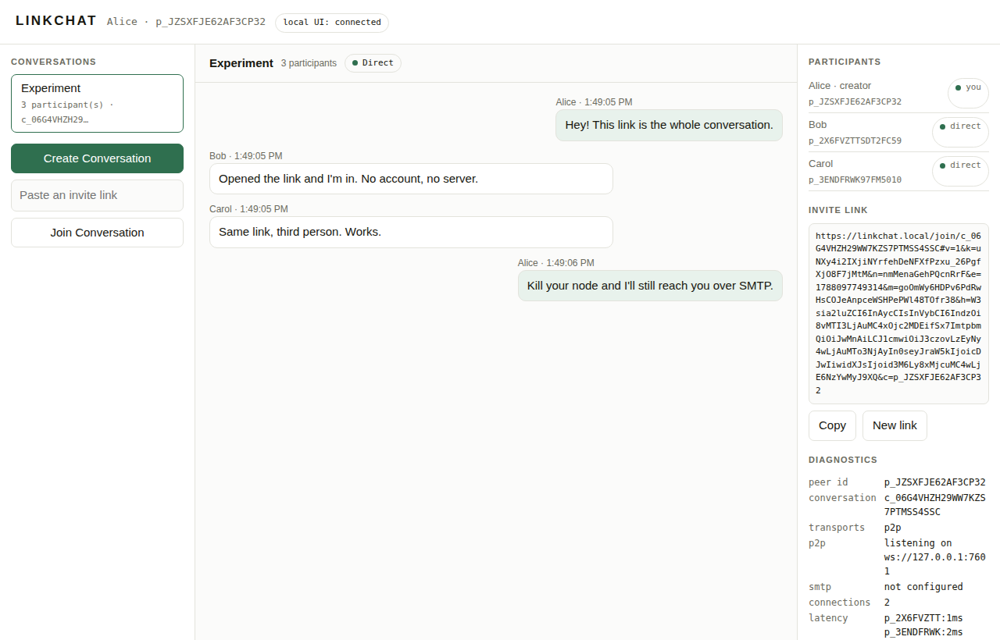

# LinkChat

An experiment in one primitive:

> **A person can communicate with another person simply by giving them a link.**

Alice creates a conversation and gets a link. She sends it to Bob however she
likes. Bob opens it and he is in the conversation. Carol opens the same link
and she is in it too. Messages go **directly between them** when a direct
connection is possible, and fall back to **SMTP store-and-forward** when it is
not — so a message reaches someone whose laptop is shut.

It is not an email client. SMTP is used here as what it actually is: a global,
federated, retrying store-and-forward network that every ISP already permits.
The user never sees it. They press Send.

---

## Run it

Requires **Node 22.6+** (native TypeScript execution — there is no build step).

```bash
cd linkchat
npm install
npm run demo     # the whole experiment, end to end, in one command
```

`npm run demo` starts a real local MTA and three real nodes, then runs and
**verifies** the full scenario: link → join → three-way group chat → a
participant disappears → SMTP holds the message → they come back → everything
converges. It exits non-zero if any step does not genuinely happen.

<details>
<summary>What the demo prints</summary>

```
1. Alice creates a conversation and gets a link
  ok  the link is a /join/ link
  ok  the secret material is in the fragment, not the path
2. Bob opens the link
  ok  Alice reaches Bob directly (peer to peer, no server in the path)
3. Carol opens the same link
  ok  Bob learned about Carol without being sent the link
...
6. Alice sends anyway
  ok  P2P failed, so the router fell back to SMTP
  ok  the MTA is holding mail for an unreachable Bob (store-and-forward)
7. Bob comes back, but only over SMTP
  ok  the queued message reached Bob over SMTP once his node was back
9. Everyone converges
  ok  all three transcripts are identical
```
</details>

### Three participants with a UI

```bash
npm run dev
```

Brings up the local MTA plus Alice, Bob and Carol as separate processes, each
with its own identity, data directory, P2P listener and web UI:

```
alice  http://127.0.0.1:7301/?t=dev-alice
bob    http://127.0.0.1:7302/?t=dev-bob
carol  http://127.0.0.1:7303/?t=dev-carol
```



Open them in three windows. In Alice's: **Create Conversation**, copy the
invite link, paste it into Bob's **Join** box, then Carol's. Send messages.
Then kill Bob's process, send from Alice, and watch the badge switch to
**SMTP** and the MTA hold the message until Bob is back.

### One terminal each

```bash
npm run dev:mta      # terminal 1
npm run dev:alice    # terminal 2
npm run dev:bob      # terminal 3
npm run dev:carol    # terminal 4
```

Or a terminal chat client with no browser at all:

```bash
node src/app/cli.ts start --name Dave --tty
> /create My conversation
> /join <link>
> /who
> hello everyone
```

### Tests

```bash
npm test         # 74 tests: identity, protocol, invites, transports, group sizes, sync, UI
npm run check    # typecheck + tests
```

The transport tests are not simulations: the P2P tests open real WebSocket
connections, and the SMTP tests submit to a real SMTP server that spools to
disk and relays onward.

---

## How it works

```
IDENTITY      Ed25519 key pair, generated on the device, never leaves it
   |
CONVERSATION  participants + a shared key, both derived from a replicated log
   |
RECORD        signed by its author, encrypted end to end, deduplicated by id
   |
FRAME         signed envelope for one hop
   |
TRANSPORT     P2P (WebSocket)  |  SMTP  |  local (in-process)
```

A conversation is a **replicated log**, not a stream. Every node holds the
whole set of records; delivery order does not matter; a record arriving twice
is a no-op. That is why "Bob was offline for an hour" and "Bob's message came
over SMTP while Carol's came over a socket" are the same problem, solved once
by anti-entropy sync.

```
                    Conversation
                          |
        +-----------------+-----------------+
      Alice              Bob              Carol
        |                 |                 |
        +---- P2P / SMTP / relayed by a peer ----+
```

No full mesh is assumed. A node floods new records to the peers it can reach,
and whoever can reach a peer forwards to them. Anything still missing is
filled in by watermark exchange on the next sync.

### The link

```
https://linkchat.local/join/c_01JX8Q…#v=1&k=…&n=…&e=…&m=…&h=…
└──────────── path: public ─────────┘ └──── fragment: secret ────┘
```

The conversation key lives in the **fragment**, which browsers never send to a
server. The invite token is an HMAC whose key is *not* in the link, so a link
holder can present the invite they were given but cannot mint a new one or
extend its expiry — which is what makes expiry and revocation actually bind.

Full specification: **[docs/LINKCHAT_PROTOCOL.md](docs/LINKCHAT_PROTOCOL.md)**.

### Layout

| Path | Holds |
| --- | --- |
| `src/crypto/` | Encoding, canonical JSON, ids, and the only calls into `node:crypto` |
| `src/identity/` | Key pair, peer id derivation, on-disk keystore |
| `src/protocol/` | Record and frame formats, signing, invites, error codes |
| `src/messages/` | The replicated log: dedupe, ordering, watermarks |
| `src/conversation/` | Membership and admission, derived purely from the log |
| `src/storage/` | Storage port; file-backed and in-memory implementations |
| `src/transports/` | The transport port, `p2p/`, `smtp/`, `local/`, and the router |
| `src/sync/` | Anti-entropy |
| `src/node/` | The node: wiring, frame handling, fan-out, the one verification point |
| `src/ui/` | Loopback HTTP + WebSocket server and a single-file web UI |
| `src/app/` | CLI and configuration |
| `devtools/` | Dev MTA, dev cluster, the verified end-to-end demo |
| `tests/` | The test suite |

---

## What works, and what does not

Nothing below is aspirational. Everything in the left column is exercised by
the test suite or the demo.

### Works

| | |
| --- | --- |
| Link → join → group chat | Any number of participants from one link; verified at 2, 3 and 10 |
| Direct peer-to-peer | Real WebSocket connections between nodes, no server in the path |
| SMTP transport | Real MIME (`application/linkchat+json`) over real SMTP, both directions |
| Automatic fallback | P2P first; SMTP when the socket fails; outbox with backoff when neither works |
| Offline delivery | The MTA holds mail for a node that is down and delivers when it returns |
| Synchronisation | Watermark anti-entropy; a peer offline for any length of time catches up |
| Cryptographic identity | Ed25519 per device; peer id is a hash of the public key |
| End-to-end encryption | AES-256-GCM per record, header bound in as associated data |
| Signed everything | Every record and every frame, verified at one choke point |
| Invitations | Expiring, revocable, unforgeable without the invite secret |
| Persistence | Identity, conversation keys and logs survive restart; keys optionally passphrase-wrapped |
| Diagnostics | Per-transport counters, connection list, latency, sync stats, rejection log |

### Does not work, or is not implemented

| | |
| --- | --- |
| **NAT traversal** | None. No STUN/TURN/ICE. "Direct" means same host, same LAN, an overlay like Tailscale, or a forwarded port. Two peers behind consumer NATs will not connect directly — the app reports that and falls back rather than pretending |
| **Forward secrecy** | One long-lived key per conversation. A leaked key decrypts all history. A ratchet (or MLS) is the right fix and is not here |
| **Member removal** | `leave` is an announcement. Without re-keying, a former participant who kept the key can still read |
| **Metadata protection** | Record headers are plaintext at rest and in transit; SMTP addresses are visible to every relay |
| **IMAP** | Receiving from a normal provider mailbox needs an external delivery agent writing to a maildir. No IMAP client is included, because it could not be tested here without live credentials |
| **A real mail server** | The dev MTA has no DNS, MX, SPF, DKIM, auth or TLS, and binds to localhost. Point `LINKCHAT_SMTP_*` at a real submission service for anything beyond a demo |
| **Rate limiting / abuse controls** | None anywhere |
| **Browser-only operation** | A browser cannot listen for connections, cannot receive SMTP, and cannot keep a key away from page script. The node holds the keys and transports; the browser is a loopback client of your own node |

`docs/LINKCHAT_PROTOCOL.md` §10 has the full threat model, and §8 explains
exactly what implementing NAT traversal would require.

---

## Configuration

Every setting is a flag or an environment variable. **No credential is ever
written to disk, put in a link, or logged.**

```bash
cp .env.example .env
```

| Variable | Purpose |
| --- | --- |
| `LINKCHAT_DISPLAY_NAME` | Name others see |
| `LINKCHAT_DATA_DIR` | Where identity, keys and logs live |
| `LINKCHAT_KEY_PASSPHRASE` | Wraps the private key with scrypt + AES-256-GCM |
| `LINKCHAT_UI_PORT` / `LINKCHAT_P2P_PORT` | Listening ports |
| `LINKCHAT_ADVERTISE_HOST` | Host published in invite links |
| `LINKCHAT_LINK_ORIGIN` | Origin used when minting links |
| `LINKCHAT_SMTP_HOST` / `_PORT` / `_SECURE` / `_USER` / `_PASS` / `_FROM` | Submission relay |
| `LINKCHAT_SMTP_ADDRESS` | Address published to peers for SMTP delivery |
| `LINKCHAT_SMTP_LISTEN_PORT` | Port for this node's own SMTP listener |
| `LINKCHAT_MAILDIR` | Watch a maildir instead of listening for SMTP |
| `LINKCHAT_SMTP_ALLOW_INSECURE` | Local dev only: permit a plaintext relay |

The invite link's origin is cosmetic — only the path and fragment carry
meaning, and the reliable way to join is to paste the link into the UI's Join
box. `--link-origin http://127.0.0.1:7302` makes links open directly in a
specific local UI, which is what `npm run dev` does.

---

## Security in one paragraph

Identities are Ed25519 key pairs generated on the device; a peer id is a hash
of the public key, so identity claims are self-verifying. Every record is
signed by its author and encrypted with AES-256-GCM under the conversation
key, with the header bound in as associated data. Every frame is signed by the
sending node and carries a nonce and timestamp checked against a replay
window. Invitations are HMAC tokens that expire and can be revoked. All
primitives come from Node's OpenSSL-backed `node:crypto`; nothing here invents
a construction. **The link is the capability**: whoever holds it can read the
conversation, there is no forward secrecy, and members cannot be removed
without re-keying. Read `docs/LINKCHAT_PROTOCOL.md` §10 before trusting it
with anything real.
